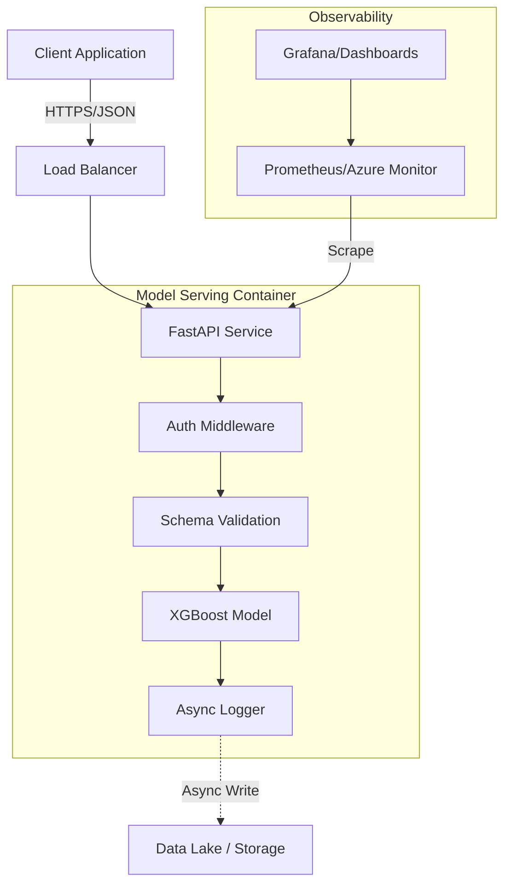
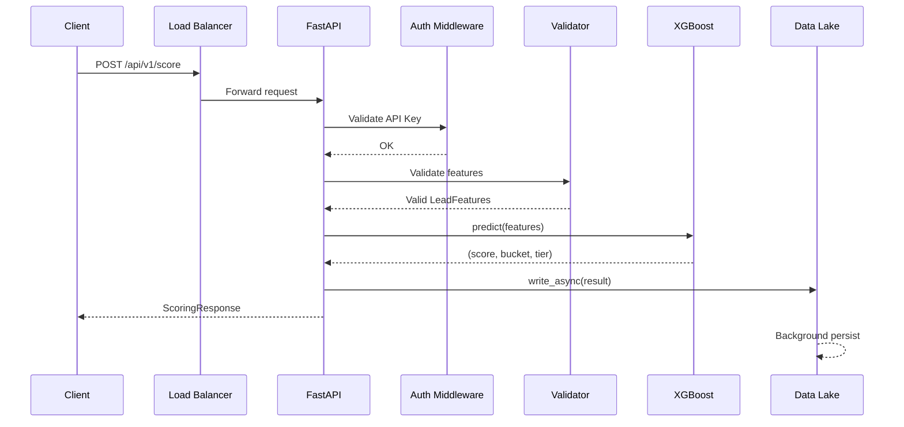

# System Architecture

## Overview

The B2B Lead Scoring system is designed as a high-performance, scalable microservice that provides real-time inference for lead conversion probability. It replaces legacy SageMaker endpoints with a cloud-native solution optimized for latency and throughput.

**Design Goals:**
- Handle 300+ requests per second
- Sub-1-second latency (P95 < 1000ms)
- 99.9% availability
- Cloud-agnostic deployment (AWS/Azure)
- Zero-downtime deployments

## High-Level Design



## Component Architecture

```
┌─────────────────────────────────────────────────────────────────┐
│                        Load Balancer                             │
│              (ALB/Azure Front Door/Ingress)                      │
└─────────────────────────────┬───────────────────────────────────┘
                              │
┌─────────────────────────────┴───────────────────────────────────┐
│                     FastAPI Application                          │
│  ┌────────────────────────────────────────────────────────────┐ │
│  │                     Middleware Stack                        │ │
│  │  ┌─────────────┐  ┌─────────────┐  ┌─────────────────────┐ │ │
│  │  │   CORS      │  │  Metrics    │  │  Request Logging    │ │ │
│  │  └─────────────┘  └─────────────┘  └─────────────────────┘ │ │
│  └────────────────────────────────────────────────────────────┘ │
│  ┌────────────────────────────────────────────────────────────┐ │
│  │                       Routers                               │ │
│  │  ┌──────────────┐  ┌──────────────┐  ┌──────────────────┐  │ │
│  │  │   Health     │  │   Scoring    │  │  Model Info      │  │ │
│  │  │   Routes     │  │   Routes     │  │  Routes          │  │ │
│  │  └──────────────┘  └──────────────┘  └──────────────────┘  │ │
│  └────────────────────────────────────────────────────────────┘ │
│  ┌────────────────────────────────────────────────────────────┐ │
│  │                    Core Services                            │ │
│  │  ┌──────────────┐  ┌──────────────┐  ┌──────────────────┐  │ │
│  │  │   Auth       │  │   Model      │  │  Data Lake       │  │ │
│  │  │   Service    │  │   Engine     │  │  Writer          │  │ │
│  │  └──────────────┘  └──────────────┘  └──────────────────┘  │ │
│  └────────────────────────────────────────────────────────────┘ │
└─────────────────────────────────────────────────────────────────┘
```

## Components

### 1. API Service (FastAPI)

The core application built with FastAPI, providing:

| Aspect | Details |
|--------|---------|
| **Framework** | FastAPI (Python 3.11) |
| **Server** | Uvicorn (ASGI) |
| **Workers** | Configurable (default: 4) |
| **Concurrency** | Async request handling |

**Key Features:**
- Asynchronous request handling for high concurrency
- Pydantic schema validation for type safety
- OpenAPI documentation (Swagger/ReDoc)
- Structured JSON logging
- Prometheus metrics integration

**Entry Point:** `api/main.py`

```python
# Application lifecycle management
@asynccontextmanager
async def lifespan(app: FastAPI):
    # Startup: Initialize model
    model = get_model()
    yield
    # Shutdown: Cleanup
```

### 2. Model Engine

The XGBoost model wrapper supporting multiple deployment modes.

| Mode | Provider | Use Case |
|------|----------|----------|
| Local | In-process XGBoost | Development, low-latency production |
| SageMaker | AWS SageMaker Endpoint | AWS cloud deployments |
| Azure ML | Azure ML Endpoint | Azure cloud deployments |

**Key Files:**
- `api/app/model.py` - Model wrapper class
- `api/app/endpoint_client.py` - Cloud endpoint clients

**Scoring Flow:**
1. Features validated by Pydantic schema
2. Features preprocessed to numpy array
3. Prediction made (local or remote)
4. Raw score (0-1) mapped to bucket (1-5)
5. Bucket mapped to tier (A-E)

```python
# Score mapping
Bucket 5 → Tier A (highest conversion likelihood)
Bucket 4 → Tier B
Bucket 3 → Tier C
Bucket 2 → Tier D
Bucket 1 → Tier E (lowest conversion likelihood)
```

### 3. Authentication Middleware

API key-based authentication protecting scoring endpoints.

**Location:** `api/middleware/auth.py`

**Configuration:**
- `API_KEYS` environment variable (comma-separated)
- Header: `X-API-Key`

### 4. Metrics Middleware

Prometheus metrics collection for observability.

**Location:** `api/middleware/metrics.py`

**Collected Metrics:**
- Request counts by endpoint/status
- Request latency histograms
- Model prediction latency
- Prediction distribution by tier

### 5. Request Logging Middleware

Structured JSON logging for all requests.

**Location:** `api/middleware/logging_middleware.py`

**Log Format:**
```json
{
  "timestamp": "2024-01-01T12:00:00Z",
  "level": "INFO",
  "message": "Scoring request completed",
  "request_id": "uuid",
  "lead_id": "LEAD-123",
  "latency_ms": 12.5,
  "score": 0.87
}
```

### 6. Data Lake Writer

Async background task for persisting scoring results.

**Location:** `api/app/datalake.py`

**Features:**
- Non-blocking writes
- Configurable storage backend
- Batch optimization ready

## Infrastructure

The system is cloud-agnostic with Terraform modules for AWS and Azure.

### Azure Implementation

```
┌─────────────────────────────────────────────────────────────────┐
│                    Azure Container Apps                          │
│  ┌─────────────────────────────────────────────────────────────┐│
│  │  Container App Environment                                   ││
│  │  ┌─────────────────┐  ┌─────────────────┐                   ││
│  │  │  API Container  │  │  API Container  │  (replicas)       ││
│  │  │  (Port 8000)    │  │  (Port 8000)    │                   ││
│  │  └─────────────────┘  └─────────────────┘                   ││
│  └─────────────────────────────────────────────────────────────┘│
└─────────────────────────────────────────────────────────────────┘
        │
        ├── Azure Container Registry (ACR)
        ├── Azure Monitor / Application Insights
        ├── Log Analytics Workspace
        └── Key Vault (optional)
```

| Component | Azure Service |
|-----------|---------------|
| Compute | Azure Container Apps |
| Registry | Azure Container Registry (ACR) |
| Monitoring | Azure Monitor / Application Insights |
| Logging | Log Analytics Workspace |
| Secrets | Azure Key Vault |

### AWS Implementation

```
┌─────────────────────────────────────────────────────────────────┐
│                         ECS Fargate                              │
│  ┌─────────────────────────────────────────────────────────────┐│
│  │  ECS Cluster                                                 ││
│  │  ┌─────────────────┐  ┌─────────────────┐                   ││
│  │  │  Task (Fargate) │  │  Task (Fargate) │  (replicas)       ││
│  │  │  API Container  │  │  API Container  │                   ││
│  │  └─────────────────┘  └─────────────────┘                   ││
│  └─────────────────────────────────────────────────────────────┘│
└─────────────────────────────────────────────────────────────────┘
        │
        ├── Elastic Container Registry (ECR)
        ├── Application Load Balancer (ALB)
        ├── CloudWatch (Logs + Metrics)
        └── Secrets Manager
```

| Component | AWS Service |
|-----------|-------------|
| Compute | ECS Fargate |
| Registry | Elastic Container Registry (ECR) |
| Load Balancer | Application Load Balancer (ALB) |
| Monitoring | CloudWatch Metrics |
| Logging | CloudWatch Logs |
| Secrets | Secrets Manager |

## Data Flow



**Request Processing Steps:**
1. **Load Balancer**: Routes request to healthy instance
2. **Auth Middleware**: Validates `X-API-Key` header
3. **Schema Validation**: Pydantic validates 50 features
4. **Model Inference**: XGBoost predicts conversion probability
5. **Post-processing**: Score bucketed into tiers (A-E)
6. **Async Logging**: Result logged to data lake (background)
7. **Response**: JSON response returned to client

## Scalability & Reliability

### Horizontal Scaling

The stateless API allows unlimited horizontal scaling:

| Platform | Scaling Mechanism | Trigger |
|----------|-------------------|---------|
| Azure Container Apps | KEDA | CPU, Memory, HTTP requests |
| AWS ECS | Application Auto Scaling | CPU, Memory, ALB requests |
| Kubernetes | HPA | CPU, Memory, Custom metrics |

**Configuration:**
```json
{
  "dev": { "min_replicas": 2, "max_replicas": 5 },
  "prod": { "min_replicas": 3, "max_replicas": 10 }
}
```

### Health Checks

Three-tier health check strategy:

| Endpoint | Purpose | Probe Type |
|----------|---------|------------|
| `/health` | Basic availability | Startup probe |
| `/health/ready` | Model loaded, ready for traffic | Readiness probe |
| `/health/live` | Process alive, not deadlocked | Liveness probe |

## Security

### Network Security

- HTTPS only in production
- Private networking for internal services (optional)

### Application Security

- API key authentication
- Request rate limiting (configurable)
- Input validation (Pydantic)
- Security scanning in CI (Bandit, Safety)

### Secret Management

| Environment | Method |
|-------------|--------|
| Development | `.env` file, environment variables |
| Azure | Key Vault (only active for Azure ML) + Managed Identity |
| AWS | Secrets Manager + IAM Role |

## Directory Structure

```
b2b-lead-scoring-model-serving/
├── api/                    # Application source code
│   ├── app/                # Core business logic
│   │   ├── model.py        # XGBoost model wrapper
│   │   ├── endpoint_client.py  # Cloud endpoint clients
│   │   └── datalake.py     # Async data persistence
│   ├── middleware/         # Request processing
│   │   ├── auth.py         # API key authentication
│   │   ├── metrics.py      # Prometheus metrics
│   │   └── logging_middleware.py  # Request logging
│   ├── routes/             # API endpoints
│   │   ├── health.py       # Health check routes
│   │   └── scoring.py      # Scoring routes
│   ├── schemas/            # Pydantic models
│   │   └── lead_features.py  # 50-feature schema
│   └── main.py             # FastAPI application
├── infra/                  # Infrastructure as Code
│   └── terraform/          # Terraform modules
│       ├── modules/aws/    # AWS resources
│       └── modules/azure/  # Azure resources
├── prometheus/             # Local monitoring config
├── grafana/                # Dashboards
├── alertmanager/           # Alert routing
├── tests/                  # Test suite
└── scripts/                # Utility scripts
```

## Related Documentation

- [API.md](API.md) - Complete API reference
- [DEPLOYMENT.md](DEPLOYMENT.md) - CI/CD and infrastructure
- [MONITORING.md](MONITORING.md) - Observability strategy
- [OPERATIONS.md](OPERATIONS.md) - Runbooks and troubleshooting