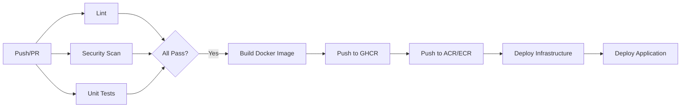

# Deployment Guide

This guide covers the complete deployment process for the B2B Lead Scoring service, including CI/CD pipelines, infrastructure provisioning, and environment management.

## Table of Contents

- [Prerequisites](#prerequisites)
- [CI/CD Pipeline](#cicd-pipeline)
- [Infrastructure as Code](#infrastructure-as-code)
- [Environment Configuration](#environment-configuration)
- [Manual Deployment](#manual-deployment)
- [Deployment Validation](#deployment-validation)
- [Rollback Procedures](#rollback-procedures)

## Prerequisites

### Local Development

- Python 3.11+
- Docker & Docker Compose
- `uv` package manager (recommended)
- Git

### Cloud Deployment

- Terraform >= 1.5
- Azure CLI or AWS CLI (configured)
- GitHub repository with Actions enabled
- Required secrets configured (see [Secrets Management](#secrets-management))

## CI/CD Pipeline

The CI/CD pipeline is implemented with GitHub Actions, providing automated testing, building, and deployment.

### Workflow Files

| File | Purpose |
|------|---------|
| `workflows/ci-cd.yml` | Main CI/CD pipeline |
| `workflows/deploy-infrastructure.yml` | Infrastructure deployment |

### Pipeline Stages



### Stage Details

#### 1. Lint (`lint`)

Runs on every push and PR.

```yaml
- Run Ruff linter
- Check code formatting
```

**Commands:**
```bash
uv run ruff check api/ tests/
```

#### 2. Security Scan (`security`)

Automated security analysis.

```yaml
- Bandit (Python security linting)
- Safety (dependency vulnerability scanning)
```

**Artifacts:** Security reports uploaded for review.

#### 3. Unit Tests (`test`)

Comprehensive test suite with coverage.

```yaml
- pytest with coverage
- Coverage report to Codecov
```

**Commands:**
```bash
uv run pytest tests/unit/ -v --cov=api --cov-report=xml
```

#### 4. Build & Push (`build-ghcr`, `publish-ecr`, `publish-acr`)

Docker image building and publishing.

**Registries:**
| Registry | Purpose |
|----------|---------|
| GHCR | Primary public registry |
| ECR | AWS production |
| ACR | Azure production |

**Image Tags:**
- `latest` - Default branch
- `<branch>-<sha>` - Branch-specific
- `v1.0.0` - Semantic versioning

#### 5. Deploy (`deploy`)

Triggered on merge to `main` or `develop`.

```yaml
- Determine environment (dev/prod)
- Trigger infrastructure deployment
- Update container service
```

## Infrastructure as Code

Infrastructure is managed with Terraform in the `infra/terraform/` directory.

### Directory Structure

```
infra/terraform/
├── main.tf                 # Entry point, provider configuration
├── variables.tf            # Variable definitions
├── outputs.tf              # Output values
├── backend.hcl.example     # Backend configuration template
├── terraform.tfvars.example # Variable values template
└── modules/
    ├── azure/              # Azure Container Apps resources
    │   ├── main.tf
    │   ├── variables.tf
    │   └── outputs.tf
    └── aws/                # AWS ECS Fargate resources
        ├── main.tf
        ├── variables.tf
        └── outputs.tf
```

### Terraform Variables

| Variable | Description | Default |
|----------|-------------|---------|
| `cloud_provider` | Target cloud (`aws` or `azure`) | Required |
| `environment` | Deployment environment | `dev` |
| `project_name` | Project name for resources | `lead-scoring` |
| `docker_image` | Docker image URL | Required |
| `api_keys` | API keys (comma-separated) | Required |
| `min_replicas` | Minimum instances | 2 |
| `max_replicas` | Maximum instances | 10 |
| `log_level` | Application log level | `INFO` |

### Backend Configuration

Terraform state is stored remotely in Azure Storage:

```hcl
# backend.hcl
resource_group_name  = "tfstate-rg"
storage_account_name = "tfstatestorage"
container_name       = "tfstate"
key                  = "dev/lead-scoring.tfstate"
```

### Provisioning Commands

```bash
cd infra/terraform

# Initialize with backend config
terraform init -backend-config=backend.hcl

# Plan changes
terraform plan \
  -var="cloud_provider=azure" \
  -var="environment=dev" \
  -var="docker_image=ghcr.io/owner/repo:latest" \
  -var="api_keys=key1,key2"

# Apply changes
terraform apply -auto-approve
```

## Environment Configuration

### Environment-Specific Settings

Configuration is managed in `infra/config/environments.json`:

```json
{
  "dev": {
    "log_level": "DEBUG",
    "min_replicas": 2,
    "max_replicas": 5
  },
  "prod": {
    "log_level": "INFO",
    "min_replicas": 3,
    "max_replicas": 10
  }
}
```

### Environment Variables

| Variable | Description | Example |
|----------|-------------|---------|
| `ENV` | Environment name | `production` |
| `LOG_LEVEL` | Logging verbosity | `INFO` |
| `API_KEYS` | Valid API keys | `key1,key2` |
| `PORT` | Server port | `8000` |
| `WORKERS` | Uvicorn workers | `4` |
| `MODEL_ENDPOINT_PROVIDER` | Model source | `local`, `sagemaker`, `azure` |
| `CORS_ORIGINS` | Allowed CORS origins | `*` |

### Model Endpoint Configuration

**Local Model:**
```bash
MODEL_ENDPOINT_PROVIDER=local
MODEL_PATH=models/model.json
```

**AWS SageMaker:**
```bash
MODEL_ENDPOINT_PROVIDER=sagemaker
SAGEMAKER_ENDPOINT_NAME=lead-scoring-endpoint
AWS_REGION=us-east-1
```

**Azure ML:**
```bash
MODEL_ENDPOINT_PROVIDER=azure
AZURE_ML_ENDPOINT_URL=https://endpoint.azureml.net
AZURE_ML_API_KEY=your-key
```

## Secrets Management

### GitHub Secrets (Required)

| Secret | Description | Required For |
|--------|-------------|--------------|
| `API_KEYS` | Application API keys | All |
| `AZURE_CLIENT_ID` | Azure service principal | Azure |
| `AZURE_TENANT_ID` | Azure tenant | Azure |
| `AZURE_SUBSCRIPTION_ID` | Azure subscription | Azure |
| `TFSTATE_RESOURCE_GROUP` | Terraform state RG | All |
| `TFSTATE_STORAGE_ACCOUNT` | Terraform state storage | All |
| `TFSTATE_CONTAINER_NAME` | Terraform state container | All |
| `AWS_ROLE_ARN` | AWS IAM role | AWS |
| `AWS_REGION` | AWS region | AWS |
| `ECR_REGISTRY` | ECR registry URL | AWS |
| `ECR_REPOSITORY` | ECR repository name | AWS |
| `ACR_LOGIN_SERVER` | ACR login server | Azure |

### Setting Secrets

Using the helper script:
```bash
./scripts/setup-github-secrets.sh
```

Using GitHub CLI:
```bash
gh secret set API_KEYS -b "<your-api-keys>"
gh secret set AZURE_CLIENT_ID -b "<your-azure-client-id>"
```

## Manual Deployment

### Local Docker

```bash
# Build image
make docker-build

# Run locally
make docker-run

# Or with docker-compose (includes monitoring)
docker-compose up --build
```

### Direct Cloud Deployment

**Azure Container Apps:**
```bash
# Login to Azure
az login

# Deploy container
az containerapp update \
  --name lead-scoring-api \
  --resource-group lead-scoring-rg \
  --image ghcr.io/owner/repo:latest
```

**AWS ECS:**
```bash
# Login to AWS
aws configure

# Update ECS service
aws ecs update-service \
  --cluster lead-scoring-cluster \
  --service lead-scoring-service \
  --force-new-deployment
```

## Deployment Validation

### Automated Validation

The deployment pipeline includes validation steps:

1. **Health Check**: Verify `/health` returns 200
2. **Readiness Check**: Verify `/health/ready` returns 200
3. **Smoke Test**: Score a sample lead

### Manual Validation

Use the validation script:

```bash
./scripts/validate-deployment.sh https://your-api-url.com
```

**Validation Steps:**
1. Root endpoint accessible
2. Health check passing
3. Readiness check passing
4. Liveness check passing
5. Metrics endpoint accessible
6. API documentation accessible
7. Authentication enforced
8. Model info retrievable

### Quick Test

```bash
# Set environment
export API_URL=https://your-api-url.com
export API_KEY=your-api-key

# Run quick test
./scripts/quick_test.sh
```

## Rollback Procedures

### Image Rollback

```bash
# List available tags
docker images ghcr.io/owner/repo

# Deploy previous version
terraform apply \
  -var="docker_image=ghcr.io/owner/repo:previous-tag" \
  -auto-approve
```

### Infrastructure Rollback

```bash
# List Terraform state versions
terraform state list

# Rollback to previous state
terraform state pull > backup.tfstate
# Restore from backup
terraform state push previous.tfstate
```

### Emergency Rollback (Azure)

```bash
az containerapp revision list \
  --name lead-scoring-api \
  --resource-group lead-scoring-rg

az containerapp ingress traffic set \
  --name lead-scoring-api \
  --resource-group lead-scoring-rg \
  --revision-weight previous-revision=100
```

### Emergency Rollback (AWS)

```bash
# Get previous task definition
aws ecs describe-services \
  --cluster lead-scoring-cluster \
  --services lead-scoring-service

# Rollback to previous task definition
aws ecs update-service \
  --cluster lead-scoring-cluster \
  --service lead-scoring-service \
  --task-definition previous-task-def:revision
```

## Deployment Checklist

### Pre-Deployment

- [ ] All tests passing
- [ ] Security scan clean
- [ ] Docker image built and pushed
- [ ] Environment variables configured
- [ ] Secrets up to date
- [ ] Terraform plan reviewed

### Post-Deployment

- [ ] Health checks passing
- [ ] Metrics being collected
- [ ] Logs streaming correctly
- [ ] Sample requests successful
- [ ] Alerts not firing
- [ ] Documentation updated

## Related Documentation

- [ARCHITECTURE.md](ARCHITECTURE.md) - System design
- [MONITORING.md](MONITORING.md) - Observability setup
- [OPERATIONS.md](OPERATIONS.md) - Runbooks
- [SCRIPTS.md](SCRIPTS.md) - Utility scripts