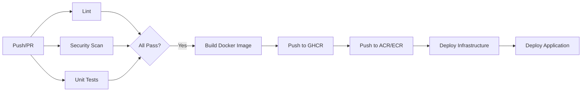

# Deployment Guide

The B2B Lead Scoring service uses a CI/CD pipeline powered by GitHub Actions and Terraform for infrastructure provisioning.

## CI/CD Pipeline

The CI/CD pipeline is implemented with GitHub Actions, providing automated testing, building, and deployment.

### Workflow Files

| File | Purpose |
|------|---------|
| `workflows/ci-cd.yml` | Main CI/CD pipeline |
| `workflows/deploy-infrastructure.yml` | Infrastructure deployment |

### Pipeline Stages



### Stages

1. **Lint & Test**:
   - Runs on every Push/PR.
   - Installs dependencies using `uv`.
   - Runs `ruff` for linting and formatting checks.
   - Runs `pytest` for unit and integration tests.
   - Runs `bandit` for security scanning.

2. **Build & Publish**:
   - Runs on push to `main` or `develop`.
   - Builds Docker image.
   - Pushes to GitHub Container Registry (GHCR) or Cloud Registry (ACR/ECR).

3. **Deploy Infrastructure**:
   - Uses Terraform to provision/update cloud resources.
   - State is managed remotely (Azure Storage / S3).

4. **Deploy Application**:
   - Updates the container service (Azure Container Apps / ECS) with the new image tag.

## Infrastructure Provisioning

Infrastructure is managed as code using Terraform in the `infra/terraform` directory.

### Prerequisites
- Terraform >= 1.5
- Azure CLI or AWS CLI configured

### Directory Structure
```
infra/terraform/
├── main.tf             # Entry point
├── variables.tf        # Variable definitions
├── modules/
│   ├── azure/          # Azure-specific resources
│   └── aws/            # AWS-specific resources
```

### Deploying Manually

1. **Initialize Terraform**:
   ```bash
   cd infra/terraform
   terraform init
   ```

2. **Plan Deployment**:
   ```bash
   terraform plan -var="cloud_provider=azure" -out=tfplan
   ```

3. **Apply Changes**:
   ```bash
   terraform apply tfplan
   ```

## Environment Strategy

- **Develop**: Deploys to a dev environment on every merge to `develop`. Used for integration testing.
- **Production**: Deploys to prod environment on merge to `main` (with manual approval gate recommended).

## Secrets Management

Secrets (API Keys, Database Credentials) should **never** be committed to code.
- **GitHub Actions**: Use Repository Secrets.
- **Runtime**: Inject as Environment Variables via the Container App/ECS configuration, preferably sourced from Azure Key Vault or AWS Secrets Manager.
